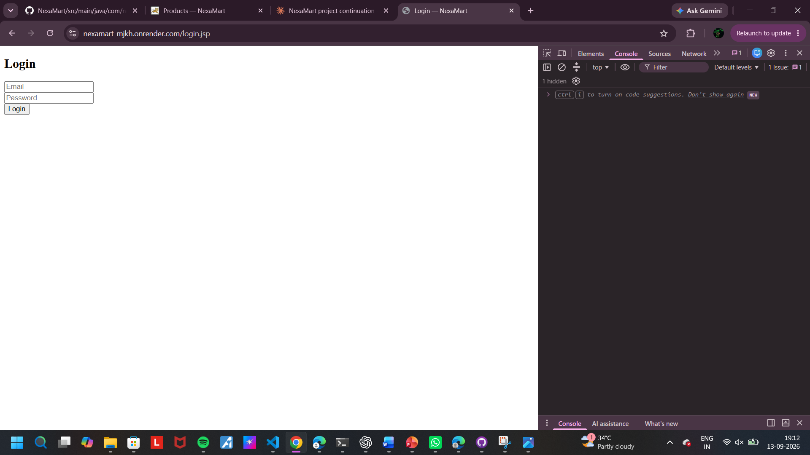
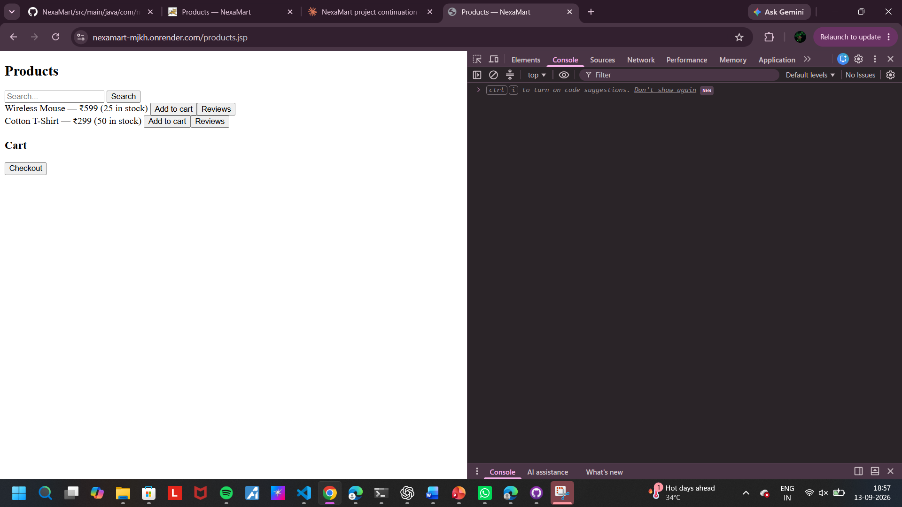
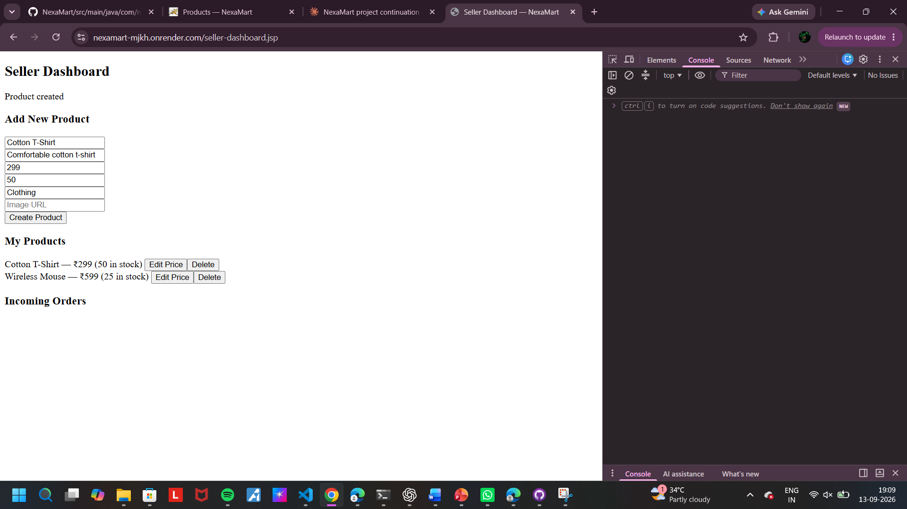

# NexaMart

A full-stack e-commerce marketplace built with Java Servlets, JSP, and a layered MVC architecture, developed as a capstone project (Anna University R2025 Sem3).

**Live demo:** https://nexamart-mjkh.onrender.com

> ⚠️ **Note:** The live demo runs on Render's free tier, which has no persistent disk. The database resets to an empty (but schema-initialized) state whenever the server restarts (after ~15 minutes of inactivity). Any products, orders, or accounts created on the demo will not persist across restarts — this is expected behavior, not a bug.

---

## Screenshots

### Login Page

### Products Page

### Seller Dashboard

---

## Features

- **Authentication** — Register/login with role-based access (Buyer, Seller, Admin), bcrypt password hashing, session-based auth
- **Product Browsing** — Search and filter products by keyword and category
- **Cart & Checkout** — Add to cart, view cart, checkout to place an order
- **Order History** — Buyers can view their past orders with line items
- **Seller Dashboard** — Sellers can create, edit, and delete their own product listings, and view incoming orders for their products
- **Admin Panel** — Admins can view all users, products, and orders, and remove products
- **Reviews & Ratings** — Buyers can rate and review products they've purchased (1–5 stars + comment)
- **Health Check** — `GET /api/v1/health` reports live DB connectivity status

---

## Tech Stack

| Layer          | Technology                          |
|----------------|--------------------------------------|
| Language       | Java 17                              |
| Web Framework  | Java Servlets + JSP (Jakarta EE)     |
| Build Tool     | Maven                                |
| Server         | Apache Tomcat 9                      |
| Database       | H2 (file-based in production, TCP server in local dev) |
| Connection Pool| HikariCP                             |
| Password Hash  | jBCrypt                              |
| JSON           | Gson                                 |
| Testing        | JUnit 5 + Mockito                    |
| CI             | GitHub Actions                       |
| Deployment     | Docker + Render.com                  |

---

## Architecture

The app follows a layered MVC pattern:
    Browser (JSP + fetch/JS)
            │
            ▼
       Servlet Layer      (HTTP handling, request/response, routing)
            │
            ▼
       Service Layer       (business logic, validation)
            │
            ▼
        DAO Layer          (SQL queries via HikariCP)
            │
            ▼
       H2 Database

- **AuthFilter** guards session-protected endpoints (`/api/v1/cart/*`, `/api/v1/checkout`, `/api/v1/orders/*`, `/api/v1/admin/*`) with a 30-minute session timeout.
- **DTOs** are used to strip sensitive fields (e.g. password hashes) before sending data to the client.
- Product browsing and creation stay outside the session filter by design (public reads, role-checked writes) so anonymous users can browse the catalog.

---

## Local Setup

### Prerequisites
- JDK 17
- Maven 3.9+
- Apache Tomcat 9
- H2 database jar (comes via Maven dependency)

### 1. Clone the repo
    git clone https://github.com/saimahasaimaha2-ship-it/NexaMart.git
    cd NexaMart

### 2. Start the H2 database
    java -cp "<path-to-h2-jar>" org.h2.tools.Server -web -webAllowOthers -tcp -tcpAllowOthers -ifNotExists -baseDir <path-to-data-dir>
Must run on port 9092 to match `config.properties`.

### 3. Build the project
    mvn clean package

### 4. Deploy to Tomcat
    rm -rf <tomcat-path>/webapps/nexamart
    cp target/nexamart.war <tomcat-path>/webapps/

### 5. Start Tomcat
    <tomcat-path>/bin/startup.sh   # or startup.bat on Windows

### 6. Access the app
Visit `http://localhost:8080/nexamart/`

---

## Running Tests

    mvn clean test

Test suite covers DAO-level tests (real in-memory H2) and Service-level tests (Mockito-mocked DAOs), including validation rules and not-found handling. Total: 35 tests across 7 test classes.

---

## Deployment

The app is containerized via a multi-stage `Dockerfile`:
1. Maven builds the WAR file
2. The WAR is copied into a Tomcat 9 + JDK 17 base image as `ROOT.war`, so the app is served from the base URL with no context path prefix

Deployed on [Render.com](https://render.com) (free tier). On startup, the app automatically applies `db/schema.sql` (idempotent, uses `CREATE TABLE IF NOT EXISTS`) so the database schema is always in place even on a fresh container.

---

## Security

- All SQL queries use `PreparedStatement` — no string-concatenated queries anywhere in the codebase (verified via `grep -rn "createStatement()" src/`, confirming the only matches are schema-loading DDL and test setup, not user-facing queries)
- Passwords hashed with jBCrypt (cost factor 12), never stored or logged in plaintext
- Custom 404/500 error pages prevent raw stack traces from leaking to visitors
- Manually tested against SQL injection (`' OR '1'='1`) on login and search — both correctly rejected/no-op rather than executing as SQL
- Manually tested against XSS (`<script>` in review comments) — renders as safe literal text, no script execution
- `config.properties` excluded from version control via `.gitignore`

---

## Known Limitations

- Render's free tier has no persistent disk — the H2 database resets on every container restart. This is acceptable for a student/demo project but would need a persistent volume or managed DB for production use.
- No pagination on product listings (fine at current data scale).

---

## Project Status

All mandatory features (F1–F8) are complete and tested end-to-end, both locally and on the live deployment. CI is green on every push via GitHub Actions.